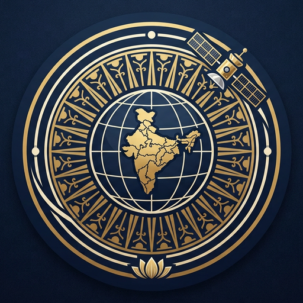

<div align="center">



# VaanEye · வான்கண்
### The Eye in the Sky

**Unified satellite intelligence for every Indian citizen**

Free ISRO, NASA and ESA satellite data turned into ONE actionable sentence —
in your language, on any phone, including a 2G feature phone.

`SIH26209` · Space Technology · AICTE · Smart India Hackathon 2026

</div>

---

## 🛰️ Live demo

The landing page renders a **real 3D Earth** with NASA textures and **7,679 real satellites**
propagated live in the browser from CelesTrak TLEs using SGP4.

**Verified accuracy:** our SGP4 output matched live ISS telemetry to **0.3 km ground error**.

| Check | Value |
|---|---|
| wheretheiss.at live API | lat −0.934, lon −145.817, alt 418.0 km |
| Our SGP4 propagation | lat −0.931, lon −145.818, alt 418.0 km |
| **Error** | **≈ 0.3 km** |
| TLE freshness | median 0.3 days |

---

## 🎯 The problem

1. **Fragmented** — one app for weather, another for crops, a third for floods. Nothing connected.
2. **Unreadable** — agencies publish petabytes free, as raw GeoTIFF rasters needing a GIS degree.
3. **Unreachable** — existing tools assume a smartphone and 4G. The most weather-exposed have neither.

## 💡 The solution

1. **Six domains, one window** — flood, fire, crop, sea, heat and encroachment in one dashboard.
2. **Raster becomes a sentence** — *"Fire 12 km north-east — move now."*
3. **Any handset** — app push, SMS, and Tamil IVR voice call for 2G phones.

---

## 🗂️ Six pillars

| Pillar | What it does |
|---|---|
| **Disaster** | SAR sees through monsoon cloud; thermal SWIR pinpoints fire hotspots |
| **Agriculture** | Weekly NDVI vigour score, SAR soil moisture, early pest-stress signals |
| **Marine** | Fishing zones from SST + chlorophyll; offline IMBL border alarm |
| **Climate** | Land Surface Temperature → street-level heatwave warnings, AQI |
| **Infrastructure** | Pixel differencing exposes illegal construction and encroachment |
| **Environment** | Oil spills, effluent and deforestation, auto-escalated to authority |

---

## 🧱 Tech stack

```
Frontend    Next.js 14 · Tailwind · Mapbox GL
3D Globe    three.js r160 + satellite.js (SGP4)
Backend     Express on Node.js 20
Database    Supabase — PostgreSQL + PostGIS
Alerts      Firebase Cloud Messaging
Last mile   SMS gateway + Tamil IVR voice
Processing  Python — GDAL, Rasterio, NumPy, PyTorch, OpenCV
```

### Why both Supabase and Firebase

| | Supabase | Firebase |
|---|---|---|
| PostGIS spatial query | ✅ R-Tree, sub-ms | ❌ |
| Push to a **closed** app | ❌ | ✅ FCM |

**Supabase = the brain** (spatial intelligence). **Firebase = the mouth** (wakes a closed phone at 2 a.m.).

---

## 📁 Repository

```
site/               the website — open site/index.html
  index.html          3D Earth landing
  app.html            6-step bilingual onboarding + dashboard
  globe.js            three.js Earth + SGP4 propagation
  sats.json           7,679 propagation-ready satellites
  tex/                NASA Earth textures
ppt/                deck generator (python-pptx)
brand/              high-resolution logo PNGs
prompts/            5 master prompts
scripts/            TLE refresh
```

---

## 🚀 Run locally

```bash
git clone https://github.com/YOUR_USERNAME/vaaneye.git
cd vaaneye
python3 -m http.server 5000
# open http://localhost:5000/site/index.html
```

## 🌐 Deploy

Free hosting on Netlify — see **[DEPLOY.md](DEPLOY.md)**.
`netlify.toml` is preconfigured; publish directory is `site`.

## 🛰️ Refresh satellite data

```bash
python3 scripts/refresh_tle.py
```

CelesTrak needs **no API key**. A GitHub Action refreshes this daily at 07:00 IST.

---

## 📊 SIH 2026 deck

| File | Purpose |
|---|---|
| `VaanEye_SIH2026_Idea_Presentation.pptx` | Editable — fill Team ID |
| `VaanEye_SIH2026_Idea_Presentation.pdf` | Preview |

Built on the official AICTE 6-slide template with section pointers unchanged.
Export the final PDF from PowerPoint so Tamil renders correctly.

---

## 📚 Data sources

ISRO Bhuvan · ESA Copernicus (Sentinel-1/2) · NASA Earthdata (Landsat, MODIS, VIIRS) ·
INCOIS · CelesTrak · Bhashini · BigEarthNet

---

<div align="center">
Built for Smart India Hackathon 2026
</div>
